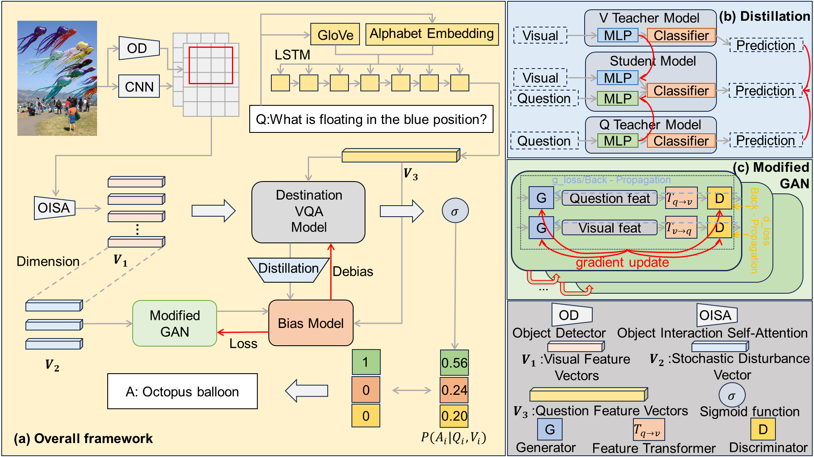

# Integrating Object Interaction Self-Attention and GAN-Based Debiasing for Visual Question Answering

This repo provides the source code & data of our paper IOG-VQA: [Integrating Object Interaction Self-Attention and GAN-Based Debiasing for Visual Question Answering.]() 

## Overview

   

### 1. Prerequisites

Python==3.8,

Pytorch==1.11.0,

approximately 50 GB of available disk space.

Install all requirements with ``pip install -r requirements.txt``.

### 2. Download data

Put the VQA-CP v2 and VQA-CP v1 datasets and other required data into the folder ``IOG-VQA/tools/data`` by  downloading from this link [google drive](https://drive.google.com/drive/folders/1r39_F1rThBpCTuettYxTI45dm4HnJVp4?usp=sharing).

Download UpDn features from [this repo](https://github.com/kobowon/cs470_project_version2) and put them in ``IOG-VQA/tools/data/detection_features``.

Download Glove from [this link](http://nlp.stanford.edu/data/glove.6B.zip), unzip it, and place it in ``IOG-VQA/tools/data/glove``.

### 3. Preprocess

Process the data with ``bash IOG-VQA/tools/process.sh``

### 4. Training

Run IOG-VQA by  ``python main.py --dataset cpv2`` 

### 5. Evaluating

Run ``python eval.py --load_path DIRNAME``

### 6. Acknowledgments

### 7. Citation
